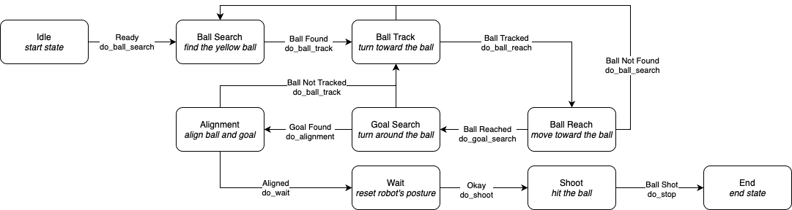

# UE52VSIK-BELL-ROUS

## The team

- BELLOT Victor (victor.bellot@ensta-bretagne.org)
- ROUSSEL Etienne (etienne.roussel@ensta-bretagne.org)

## Strategy

### Actions

- head's yaw & pitch rotation
- forward & lateral walking speed
- body yaw rotation

### Measurements

- ball_distance : 0 if not found, the distance otherwise
- goal_detected : boolean
- ball center pixel
- goal barycenter pixel
- using a mean filter after removing extremum values

### Relations

- ball_distance -> dx & dy (to get ready for shooting)
- ball & goal position -> head & body attitude -> coupled by dy

### Using a Finite State Machine (FSM)

- described in 'fsm_nao_soccer.txt'
- run using 'run_fsm.py' by passing your virtual camera path as argument (".../nao/UE52-VS-IK/imgs"")
- NaoSoccer's methods in the NaoSoccer class

### Results

Does it work? [video](nao_goal.mp4)
